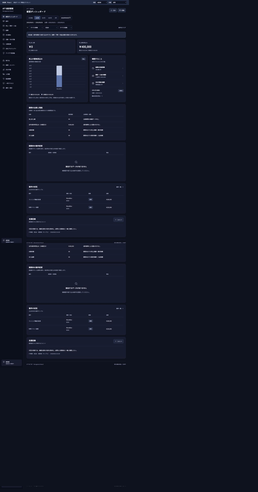
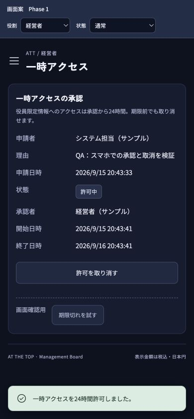

# Phase 1 独立QA結果 — 2026年9月15日

**最新判定: 下記の不具合6件と既知の未反映1件を修正し、独立再検証を通過した。取引先編集入口と320pxのボタン表示も対応済み。** 詳細は [修正・再検証結果](fixes/README.md)。以下は修正前の初回QA記録である。 利用者の依頼により財務・業務フロー・連携の3 subagentと親担当が分担して検証した。要件責任者・役員の承認を代行した記録ではない。

初回QAの対象HEAD: `a704317cb901c79b57ec5da0b9848c251d7af8b4`。UIソースは `d8a9cab929586406c9c7a1b8688b467e8c8bd871` の画面案。ローカル4176番をIAB/Chromeで操作し、稼働PoCの実データを変えずに既存114テストを実行した。実Slack・Cloudflareの管理画面は読み取りのみ。ソース修正・デプロイ・Slack投稿はしていない。

## 1. 初回QAの指摘（修正・再検証済み）

重要度は画面案のレビューを進める上での優先度。稼働中の実データで発生した障害とは区別する。

| ID | 優先度 | 再現結果 | 確認項目・詳細 |
| --- | --- | --- | --- |
| W01 | P1 | 同名の別取引先を統合すると、対象外の既存案件2件まで別取引先へ移る | P11 / [再現手順](workflow-qa.md#w01-同名の別取引先を統合すると無関係な既存案件まで付け替わる) |
| FQA-02 | P1 | 共同担当で絞ると案件が集計から抜ける。期待520,000円に対し400,000円 | P03 / [財務報告](finance-qa.md#fqa-02-共同担当者で絞ると自分の案件が消える) |
| FQA-01 | P1 | 未設定月の予算・人件費・利益を0円として表示する | P03 / [財務報告](finance-qa.md#fqa-01-未設定の予算人件費を0円と表示する) |
| RQA-01 | P1 | 未設定月から「月次予算」を開くと画面全体が消える | P04 / [追加再現](root-qa.md#rqa-01-未設定月から予算画面へ移動すると画面全体が消える) |
| W02 | P2 | 事業の開始日より前の終了日で無効化できる | P13 / [業務フロー報告](workflow-qa.md#w02-事業無効化で開始日より前の終了日を保存できる) |
| W03 | P2 | 所属ごとの開始・終了日を設定できず、兼務変更の前後値も履歴に残らない | P13 / [業務フロー報告](workflow-qa.md#w03-所属ごとの期間を設定できず兼務変更の前後値も履歴で確認できない) |
| P-既知01 | 既知 | Slackにはある「日本デザイン」が画面案にはない | P08 / [再確認](finance-qa.md#fqa-03-日本デザインが画面案に未反映) |

初回QAでは取引先の通常編集入口も不足していた。これは上表の不具合6件とは別の要件網羅性の指摘。現在は通常編集と変更履歴を追加し、320pxのコメント登録ボタンの改行も改善・確認済み。

## 2. 合格した範囲

- 財務: 9月の基準額、10日区分と前区分比較、予算の日割り抑止、成約と売上計上の分離、分割合計・請求前入金の制御、理由付き取消、締め後の編集拒否・再照合・解除履歴。
- 業務: 複数の次の行動、期間逆転の拒否、未定の並び、完了・取消、総務の操作制限、最後のシステム担当の保護、年度変更・復元申請と承認、競合比較と再適用。
- 表示・出力: 総務の秘匿項目除外、実CSVの保存・文字化けと値の照合、スマホ390px/320pxの表示・コメント登録と訂正、メニューのキーボード操作、一時アクセスの24時間承認・取消・期限切れ。
- PoC: 既存 **114テスト成功（0失敗・0スキップ）**。本人別メンション、登録済み代理回答、実回答者ID、初回・修正の10候補、確認・理由、完了時のメンション抑止をコードとローカル試験で確認。新たな実Slack送信・タップの成功とは扱わない。

細かな未操作分岐は各担当報告に記載。「合格」は記載した範囲の結果で、全入力・本実装・利用者受入の完了を意味しない。

## 3. 管理設定で分かったこと

- **Slack infoの個人2FAはアクティブ**。有効化確認を完了扱いに変更できる。新規ログイン・復旧手段と保管先のアクセス体制は未確認。
- **Workers FreeはActive、契約一覧に追加契約なし、支払方法登録なし**。利用量担当は合意済みの花沢。
- **Cloudflare自身の2FAはInactive**。#8の残作業として明記する。GitHub側の2FAとは別の観測。

証拠と確認範囲は [親担当報告](root-qa.md#管理画面の読み取り結果)。

## 4. 次の順序

1. #13の上記指摘は修正・再検証済み。次は未操作分岐と要件責任者・役員の業務レビューを記録する。技術QAを通過した項目の全件再操作を利用者へ依頼しない。
2. 自動で完了にできない項目は残す。PDF実ファイル保存、実機差、Slack本人の操作・端末通知、アカウント再ログイン・復旧体制、要件責任者・役員の判断が該当する。
3. #9の本体本番/検証環境、#11の安定受信・停止復旧等、#12の最終解析仕様、#43の継続再通知は別の技術作業として進める。9月11日の限定試験を定期再通知の完成とは扱わない。

取消・返金などの追加問い合わせを再開する必要はない。ユーザー決定どおり、不都合が生じた時に再検討する。

## 記録

- [項目ごとの現状チェックリスト](../../user-verification.md)
- [財務・経費・締め P01〜P09](finance-qa.md)
- [業務フロー・管理 P10〜P13・P17・P18](workflow-qa.md)
- [権限表示・スマホ・出力・管理設定](root-qa.md)
- [PoC 114テスト・Issue #6〜#12の証跡照合](integration-qa.md)

写真はこの実行でブラウザーから取得したPNGをそのまま保存・目視確認した。表中の初回失敗は [再検証](fixes/README.md) で解消を確認済み。外部設定・実データの更新、Google Docs更新、追加課金はない。
