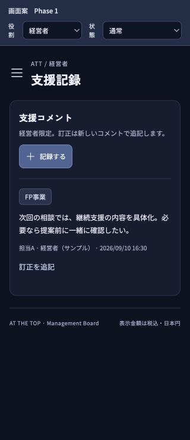
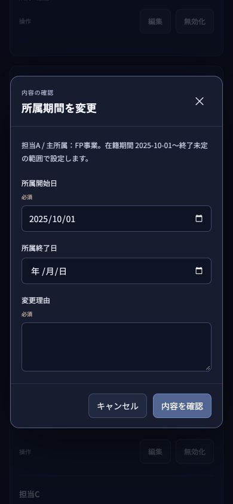

# 画面案の修正・再検証結果

2026-09-15 / 対象: この記録と同じコミットの `docs/ui-prototype`、ローカル4176番。修正前は `f2c3937`。対象ソースのハッシュは [source-sha256.txt](source-sha256.txt) に保存。

**初回QAの不具合6件、日本デザインの未反映、取引先編集入口の不足を修正し、独立した再検証を通過した。** 320px幅の支援コメント登録ボタンも改善した。Issue #13の業務・役員レビューは未完了のためOPENを維持する。

## 修正と確認結果

| 対象 | 修正後の動作 | 確認 |
| --- | --- | --- |
| W01 / P11 | 同名でも取引先IDで統合対象を限定。対象外の既存案件は変わらない。旧ID・前後の名称・理由・実行者・日時を残す | PASS: 0件・1件の参照先統合と既存2案件の維持 |
| FQA-02 / P03 | 主担当・共同担当の両方で案件を抽出し、関連する売上予定・実績・請求入金残高にも同じ条件を適用 | PASS: 担当Bの着地520,000円、計上120,000円、部分入金後の未入金60,000円、CSV値一致 |
| FQA-01 / P03 | 欠けている予算・人件費を「未設定」と表示。未設定を含む期間も部分合計で埋めず、登録済み0円と区別 | PASS: 未設定月・部分登録・複数月集計・利益と予算差・CSV |
| RQA-01 / P04 | 未作成月の月次予算・人件費を開いても停止せず、項目ごとに登録できる | PASS: 2025-09を表示し、0円登録、未設定→0円の履歴を確認 |
| W02 / P13 | 事業・メンバーの無効化時も開始日より前の終了日を拒否。メンバー終了時は所属も終了 | PASS: 両種別の逆転拒否、同日境界、履歴、新規候補からの除外 |
| W03 / P13 | 各所属を事業ID・主所属/兼務・開始/終了日で保持。在籍期間内の検証と、兼務・期間を含む変更前後の履歴を追加 | PASS: 所属別変更、境界、他所属の維持、兼務削除後の旧履歴保持 |
| P-既知01 / P08 | 「日本デザイン」を自社不動産事業と日本酒の間に追加。経費は全社共通を含む10候補 | PASS: 初回分類・修正・選択済み表示と順序 |
| 取引先の通常編集 | 名称・種別を理由付きで編集し、IDを保って参照案件へ反映 | PASS: 必須検証、確認・キャンセル、前後値・理由・実行者・日時 |
| 案件からの取引先変更 | 案件フォームからの変更も専用履歴へ記録 | PASS: コードレビューで発見した抜けを追加修正し、A-001→A-002の実操作で確認 |
| 320pxの支援記録 | ボタンを「記録する」に短縮し、一行で表示 | PASS: 幅320/scrollWidth320、ボタン90×40px、対象未指定の保存を拒否 |

## 独立QAと証跡

- [財務QA報告](finance/report.md): 画面操作、スクリーンショット5枚、CSV欄の内容2件、DOM記録、console 0件。
- [業務・管理QA報告](workflow/report.md): 画面操作、スクリーンショット5枚、詳細DOM記録、console 0件。
- コードレビュー担当は取引先の直接変更履歴の欠落を指摘。親担当が修正し、業務QAが再確認した。他の対象差分に追加指摘なし。
- 親担当は320×740・390×844で所属期間フォームの文字・入力・確認/キャンセルボタンが収まり、本文の横はみ出しがないことを確認。console error/warn 0件。検証後はブラウザーの幅指定を解除。[DOM記録](mobile-evidence.json)。
- [回帰テスト7件成功](regression-tests.txt)、[ビルド成功](build-summary.txt)。既存の500 kB超チャンク警告は継続。PoCコードは今回変更せず、初回QAの114テスト結果は前回の記録として保持。

## 確認範囲の限界

検証は架空データを使うローカル画面案。永続DB、実認証・認可、Slack投稿、Cloudflare配置、課金設定は対象外。今回の財務CSVは画面内の内容を照合・保存した証跡で、経営者のCSVダウンロードやPDF保存の成功とは扱わない。所属期間の過去時点集計は本実装で確認する。

修正対象の再検証は完了。全画面・全役割・全入力の直積試験や、要件責任者・役員の判断を代行したものではない。残る未操作分岐と業務レビューは [チェックリスト](../../../user-verification.md) に記載する。
